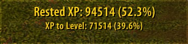

## Installation

1. Download/clone this repository or add this repo link to the Turtle WoW Addon tab (click the Add new addon button)
2. Copy the folder into your WoW client’s `Interface/AddOns/` directory.
3. Restart (or `/reload`) the game.

## Screenshot

### Rested XP Display

